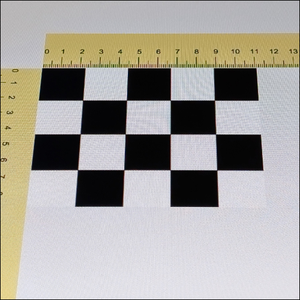
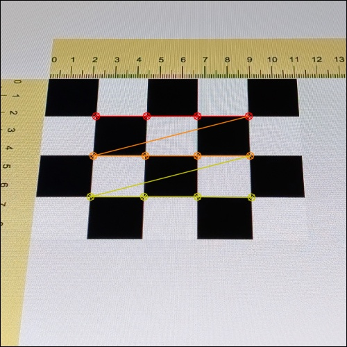

# OpenCv Camera Calibration via REST API

Open CV Camera Calibration Functionality provided as REST API.  
I am not an OpenCV nor a Python expert, so any feedback is welcome!

## Getting Started

This service is ready to be deployed as a Docker container.  
It makes it easy to integrate camera calibration functionality into your applications via REST API.

### Running Locally

Run `docker compose up` in project root to start the service locally.  
Open API Specification is available at `http://localhost:8000/docs`

### Running the Development Environment

This project leverages remote containers technology for local development.
Use VS Code with "Dev Containers" extension to open the project in a container.

- Install and start Docker Desktop
- Install VS Code with "Dev Containers" extension
- Clone the repository and open it in VS Code
- Click "Open Remote Window" in the bottom-left corner of VS Code and select "Reopen in Container"

This setup uses `.devcontainer/devcontainer.json` and `Dockerfile.devcontainer` files to set up the development environment.  
After the container is built and started, the server starts up with reload enabled.  
You can access the API at `http://localhost:8000`.

## Test Requests

For testing purposes, the [endpoints.http](endpoints.http) file contains a request with a base64 encoded image from assets, including chessboard specification and sample world points in mm.

During calibration, the detected corners are drawn on the image and saved to `output/image_detected_corners.jpg`.

## References

- <https://docs.opencv.org/4.x/dc/dbb/tutorial_py_calibration.html>
- <https://github.com/fastapi>
- <https://github.com/fastapi/full-stack-fastapi-template>
- <https://longervision.github.io/2017/03/16/ComputerVision/OpenCV/opencv-internal-calibration-chessboard/>
- <https://github.com/LongerVision/Examples_OpenCV/tree/master/01_internal_camera_calibration>
- <https://docs.opencv.org/3.4.0/d9/dab/tutorial_homography.html#tutorial_homography_Demo3>
